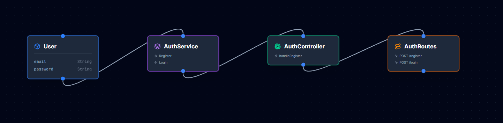

# 🚀 Arachnet

### Visual Backend Architecture. Production-Ready Code. Instantly.

Arachnet é uma plataforma visual que permite construir APIs arrastando blocos em um canvas infinito — e gerar um backend completo, estruturado e pronto para produção com um clique.

Pare de escrever boilerplate.
Comece a arquitetar visualmente.

---

## 🧠 O Problema

Toda API começa igual:

- Estrutura de pastas
- Models
- Controllers
- Services
- Rotas
- Middleware
- Validações
- Conexão com banco
- Auth
- README

Repetitivo. Demorado. Propenso a erro.

Arachnet elimina isso.

---

## 🎨 Como Funciona

1. Escolha sua stack (Node.js, Python, etc.)
2. Arraste componentes no canvas:
   - Model
   - Service
   - Controller
   - Route
   - Database
   - Auth
   - Middleware
3. Conecte os blocos visualmente
4. Clique em **"Generate Code"**
5. Baixe o projeto completo pronto para rodar

É como desenhar arquitetura no quadro…
Mas o código já sai pronto.

---

## 🧩 Exemplo Visual

## ⚙️ O Que É Gerado

Estrutura exemplo (Node + Express):

/src
/models
/controllers
/services
/routes
/middlewares
/config
/tests
Dockerfile
docker-compose.yml
.env.example
README.md
